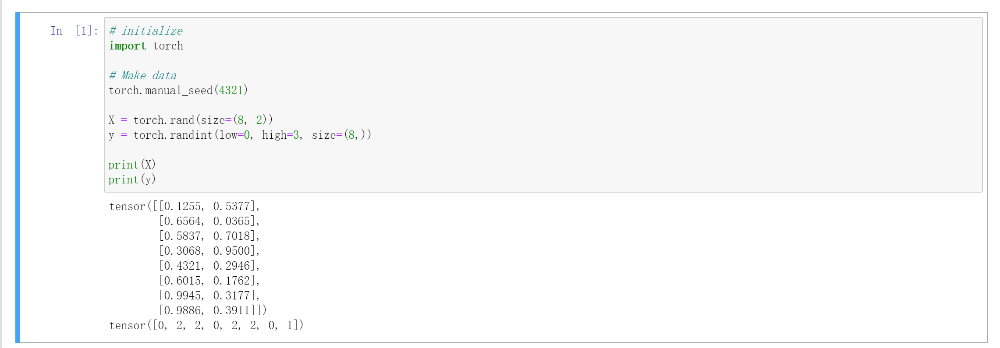
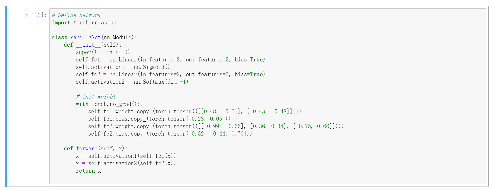
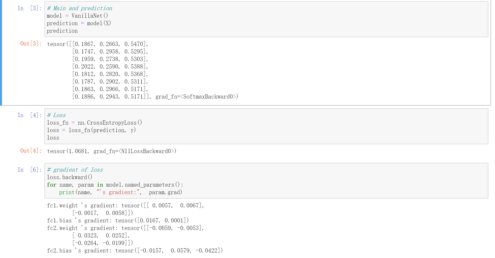

# Machine Learning and Artificial Intelligence

## Assignment 1

ID: 12232418 		Name: Jiang Yuchen

According to the question, we are requested to construct the neural network and perform forward pass and backward process. The environment requirements are: `torch==1.13`, `python=3.7`.

### Prepare data

Using random seed 4321 to prepare data.

### Construct Network

According to the requirement, build two linear layers and two activation functions as the whole network. Using `copy_` function to initialize the weight and bias in two linear layers.

### Forward and Backward

Create instance of the model. Taking `X` as input and get the forward result which is the prediction.

Then, using `nn.CrossEntropyLoss()` to calculate categorical cross entropy.

Last, using `loss.backward()` to get the gradient of parameters in the model.

