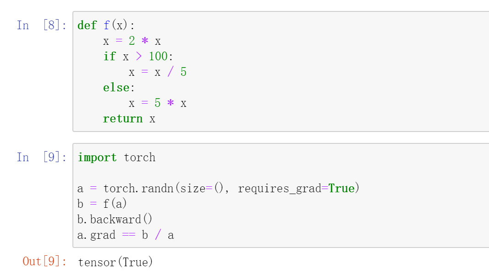
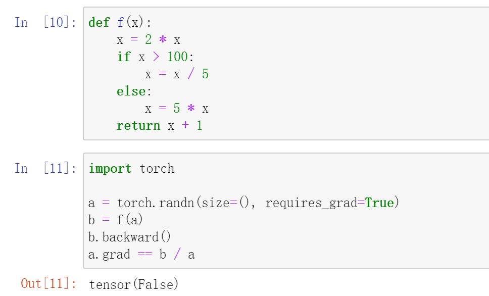

# Machine Learning and Artificial Intelligence

## Assignment 2

**ID: 12232418** 		**Name: Jiang Yuchen**

### Q1: For a tensor X of arbitrary shape, does len(X) always correspond to the length of a certain axis of X? What is that axis?

**Answer:** Yes. It's always the first axis for len(X), which means axis=0.

### Q2: Run A / A.sum(axis=1) and see what happens. Can you analyze the reason?

**Answer:** The error occurs. Suppose A's dimension is $[a_1, a_2, ..., a_k]$, then the result dimension of `A.sum(axis=1)` is $[a_1, a_3, ...,a_k]$, which doesn't satisfy the required dimension for division.

### Q3: When traveling between two points in Manhattan, what is the distance that you need to cover in terms of the coordinates, i.e., in terms of avenues and streets? Can you travel diagonally?

**Answer:** According to the google map, we can see that the streets are all horizontal or vertical, which reminds me about Manhattan distance ($d(i,j)=|x_i-x_j|+|y_i-y_j|$). Then we find that horizontal and vertical axis are marked as streets and avenues.

Thus, we can define that $d(i,j)=|Avenues_i-Avenues_j|+|Streets_i-Streets_j|$, which describe the distance in terms of avenues and streets. It's obvious we can't travel diagonally or you may travel through buildings instead of avenues or streets.

### Q4: Find the gradient of the function $f(x)=3x_1^2+5e^{x_2 }$.

**Answer:** Since there are two variable $x_1,\ x_2$ in this function, we will compute two gradients.

$\dfrac{\partial\ f(x)}{\partial\ x_1}=\dfrac{\partial\ (3x_1^2+5e^{x_2})}{\partial\ x_1}=6$ and $\dfrac{\partial\ f(x)}{\partial\ x_2}=\dfrac{\partial\ (3x_1^2+5e^{x_2})}{\partial\ x_2}=5e^{x_2}$

Thus, the gradient of $x_1$ is 6, the gradient of $x_2$ is $5e^{x_2}$.

### Q5: Can you write out the chain rule for the case where u = f(x, y, z) and x = x(a, b), y = y(a, b), and z = z(a, b)?

**Answer:** According to the question, using chain rule,

$\dfrac{\partial\ u}{\partial\ a} = \dfrac{\partial\ u}{\partial\ x}*\dfrac{\partial\ x}{\partial\ a}+\dfrac{\partial\ u}{\partial\ y}*\dfrac{\partial\ y}{\partial\ a}+\dfrac{\partial\ u}{\partial\ z}*\dfrac{\partial\ z}{\partial\ a}=\dfrac{\partial\ f(x,y,z)}{\partial\ x}*\dfrac{\partial\ x(a,b)}{\partial\ a}+\dfrac{\partial\ f(x,y,z)}{\partial\ y}*\dfrac{\partial\ y(a,b)}{\partial\ a}+\dfrac{\partial\ f(x,y,z)}{\partial\ z}*\dfrac{\partial\ z(a,b)}{\partial\ a}$ 

$\dfrac{\partial\ u}{\partial\ b} = \dfrac{\partial\ u}{\partial\ x}*\dfrac{\partial\ x}{\partial\ b}+\dfrac{\partial\ u}{\partial\ y}*\dfrac{\partial\ y}{\partial\ b}+\dfrac{\partial\ u}{\partial\ z}*\dfrac{\partial\ z}{\partial\ b}=\dfrac{\partial\ f(x,y,z)}{\partial\ x}*\dfrac{\partial\ x(a,b)}{\partial\ b}+\dfrac{\partial\ f(x,y,z)}{\partial\ y}*\dfrac{\partial\ y(a,b)}{\partial\ b}+\dfrac{\partial\ f(x,y,z)}{\partial\ z}*\dfrac{\partial\ z(a,b)}{\partial\ b}$

### Q6: Redesign an example of finding the gradient of the control flow. Run and analyze the result.

**Answer:** According to the question, we design an example for control flow. The result shows that backward result equals to output dividing input. 

However, if we design another example, which just add 1 to function result. The result changes since the function is not a linear function without bias, which makes `a.grad != b / a`. Thus, the gradient computation is not always output dividing input.

### Q7: A coin with 40% chance for heads is tossed 10 times. Let X be the variable representing the number of heads. The probabilities for X, P(X), are shown in the table below. What is the value of the variance?

| **X**    | 0     | 1      | 2      | 3     | 4      | 5      | 6      | 7      | 8      | 9      | 10     |
| -------- | ----- | ------ | ------ | ----- | ------ | ------ | ------ | ------ | ------ | ------ | ------ |
| **P(x)** | 0.006 | 0.0403 | 0.1209 | 0.215 | 0.2508 | 0.2007 | 0.1115 | 0.0425 | 0.0106 | 0.0016 | 0.0001 |

**Answer:** According to the table, $E(X) = \sum_x xP(X=x)=0*0.006+1*0.0403+2*0.1209+3*0.215+4*0.2508$

$+5*0.2007+6*0.1115+7*0.0425+8*0.0106+9*0.0016+10*0.0001=4.0005$

Thus, $Var[X]=E[(X-E[X])^2]$, let $Y=(X-E[X])^2$

Then, 

| Y        | 0.0000 | 1.0010 | 4.0020 | 9.0030 | 16.0040 | 25.0050 | 36.0060 |
| -------- | ------ | ------ | ------ | ------ | ------- | ------- | ------- |
| **P(x)** | 0.2508 | 0.4157 | 0.2324 | 0.0828 | 0.0166  | 0.0016  | 0.0001  |

$Var[X]=E[(X-E[X])^2]=E(Y)=\sum_yyP(Y=y)=2.4009$

Thus, the value of the variance is 2.4009. (Considering the significant figures in original table, there is bias between actual result)