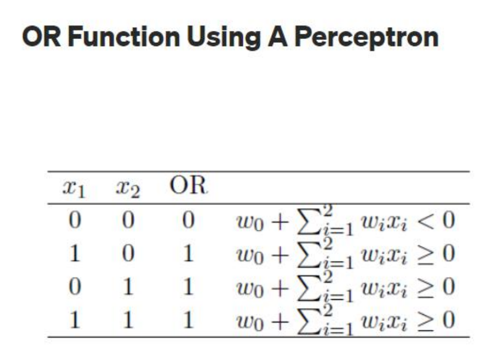
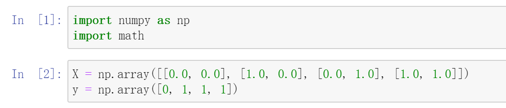
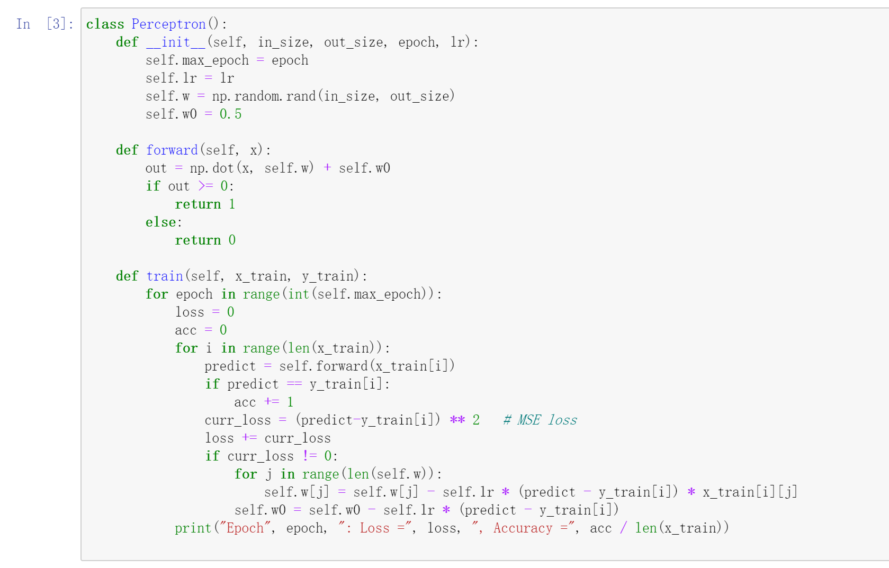
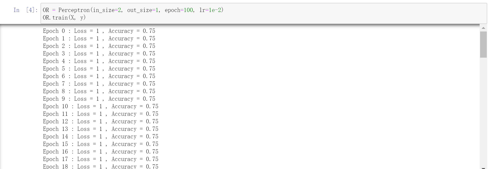
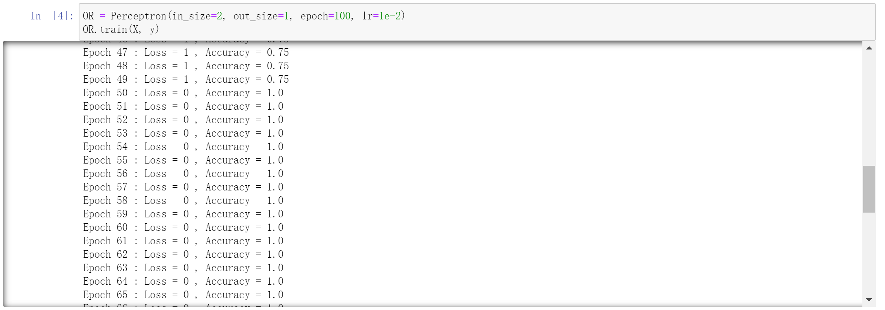
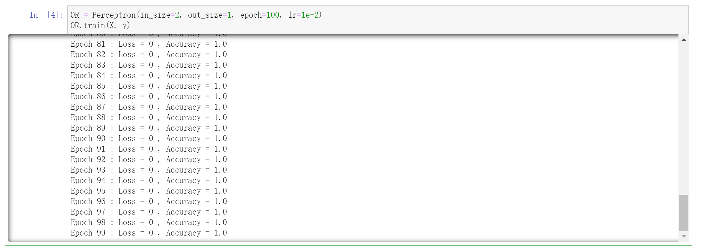

# Machine Learning and Artificial Intelligence

## Assignment 3

**ID: 12232418** 		**Name: Jiang Yuchen**

According to the question, we need to use perceptron to learn an OR function. The training data is given as below.

**First, we introduce the packages and prepare the data.**

**Then, define the Perceptron class and write forward function and training process. It's hard to decide how to update the parameters since the activation function can't give a non-zero gradient. Thus, we just consider the gradient of other parts. We use Mean Square Error as loss function.**

 **Last, train the perceptron with given four pieces of data. Max epoch and learning rate are set to 100 and 0.01 respectively. It converges at epoch 50.**

