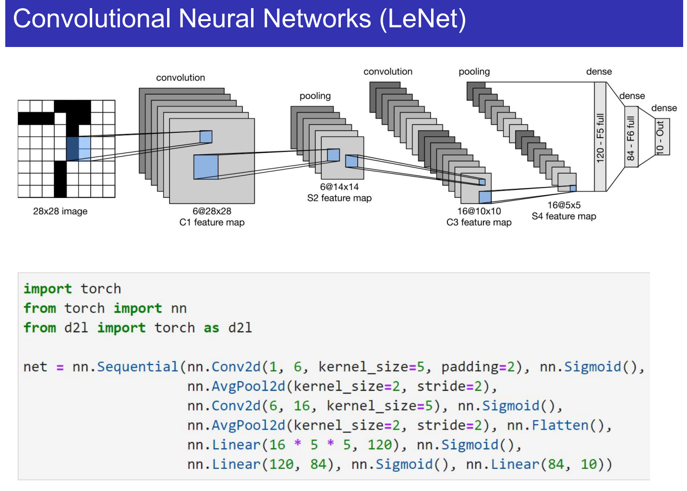
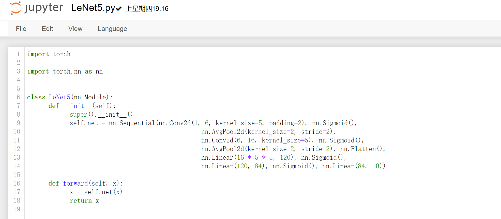

# Machine Learning and Artificial Intelligence

## Assignment 4

**ID: 12232418** 		**Name: Jiang Yuchen**

According to the question, we need to construct LeNet-5 to build the model to identify hand-written dataset.

The environment requirements are: pytorch and opencv-python. Using `conda env create -f mlai.yaml` to create the environment in your device.

**First, construct the network according to the lecture.**





**Then, load MNIST dataset for training. Since we use `from torchvision.datasets import mnist` , it's naturally divided into train and test set. We directly use them. Also, we just transform these images into tensors for training. Other setting:**

```python
device = 'cuda' if torch.cuda.is_available() else 'cpu'
batch_size = 256
model = LeNet5().to(device)
optimizer = Adam(model.parameters(), lr=1e-3)
loss_fn = CrossEntropyLoss()
all_epoch = 100
```

**Then, start training and saving the model states.**

```
Epoch 0/100: Loss=1.163798, Accuracy=0.689100
Epoch 1/100: Loss=0.612977, Accuracy=0.838400
Epoch 2/100: Loss=0.443324, Accuracy=0.886400
Epoch 3/100: Loss=0.351810, Accuracy=0.908300
Epoch 4/100: Loss=0.301460, Accuracy=0.922400
Epoch 5/100: Loss=0.267620, Accuracy=0.932200
Epoch 6/100: Loss=0.242694, Accuracy=0.939700
Epoch 7/100: Loss=0.223391, Accuracy=0.946700
...
Epoch 91/100: Loss=0.014673, Accuracy=0.986600
Epoch 92/100: Loss=0.006980, Accuracy=0.987500
Epoch 93/100: Loss=0.002542, Accuracy=0.985600
Epoch 94/100: Loss=0.001653, Accuracy=0.983200
Epoch 95/100: Loss=0.002920, Accuracy=0.980000
Epoch 96/100: Loss=0.001504, Accuracy=0.985900
Epoch 97/100: Loss=0.001837, Accuracy=0.985600
Epoch 98/100: Loss=0.001890, Accuracy=0.986800
Epoch 99/100: Loss=0.011064, Accuracy=0.987200
Model finished training
```

**Finally, using hand-written images for prediction.**

Since the background noise is too large to predict when taking photos of hand-written images, we scan the hand-written numbers into pdf file and divide them by hand (in the path './test_imgs/raw'). Besides, using `cv2` to resize the image into 28*28 as MNIST dataset.

When predicting, we need to turn white background into black as MNIST dataset. Prediction results are:

| Predict*2\Raw | 0    | 1    | 2    | 3    | 4    | 5    | 6    | 7    | 8    | 9    |
| ------------- | ---- | ---- | ---- | ---- | ---- | ---- | ---- | ---- | ---- | ---- |
| number_0.png  | 9    | 1    | 2    | 3    | 4    | 5    | 6    | 7    | 8    | 7    |
| number_1.png  | 0    | 1    | 2    | 3    | 4    | 5    | 6    | 7    | 8    | 9    |

The results show that errors occur for number 0 and number 9, which may due to their similar structures. Accuracy is 90%.


Details show in python and jupyter notebook files.