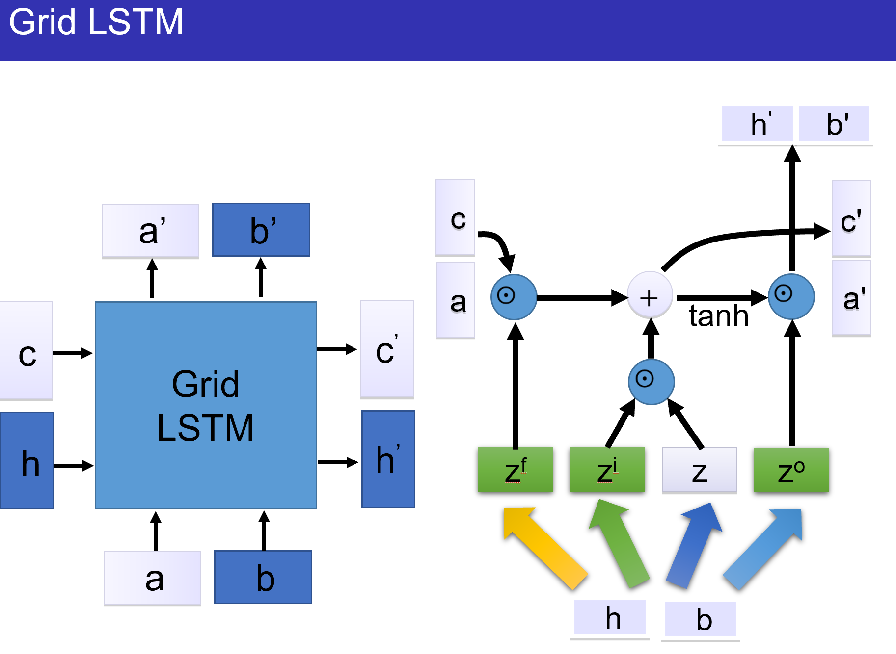
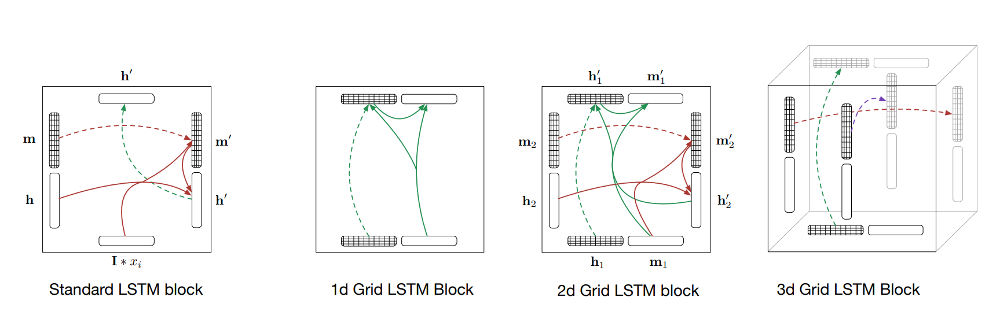
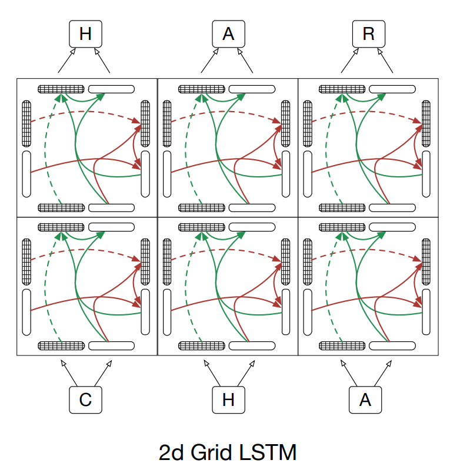

# Machine Learning and Artificial Intelligence

## Assignment 5

**ID: 12232418** 		**Name: Jiang Yuchen**

### Q1: Provide your argument to show that a naive RNN has a vanishing gradient problem when doing backward propagation 

**Answer:** 

According to the question, due to its structure, naive RNN has vanishing gradient problem when doing backward propagation. In a naive RNN, each neuron receives inputs from the previous timestep and applies the same set of weights to these inputs, in addition to the inputs from the current timestep. Thus, when doing backward propagation, the gradient of the error with respect to the weights is calculated by multiplying the gradients at each timestep according to the Chain Rule. If the gradients are small, it will be very small after multiplying many times, which leads to vanishing gradient problem.

### Q2: Write out the complete mathematical representation of the cell state and the hidden state at along the time-direction and the depth direction for the 2D grid LSTM.

**Answer:**

According to the structure of 2D grid LSTM

- **In time direction**, there is some difference which take place for $x_t$ , which is replaced by first cell state of depth direction. It's initialized as $x_t$ for hidden state and cell state for depth direction. 

​		First, we define $x$, $h$ as original input and hidden state variable. We use `'` to represent variable in depth direction. $C'_0=x$

​		Input gate: $i_t=\sigma(W_{ii}C'_t+W_{hi}h_{t-1}+b_i)$

​		Forget gate: $f_t=\sigma(W_{if}C'_t+W_{hf}h_{t-1}+b_f)$

​		Output gate: $o_t=\sigma(W_{io}C'_t+W_{ho}h_{t-1}+b_o)$

​		Candidate cell state: $g_t=tanh(W_{ig}C'_t+W_{hg}h_{t-1}+b_g)$

​		**Cell state:** $C_t=f_t*C_{t-1}+i_t*g_t$

​		**Hidden state:** $H_t=o_t*tanh(C_t)$, where $W$ means weights for each gate and $b$ means bias in each gate functions. * means element-wise multiply.

- **In depth direction**, according to the figure, another LSTM structure is applied to $h_1$ and $m_1$. Hidden state $H_t$ in time direction is used as $x_t$ in depth direction. Therefore

​		Input gate: $i'_t=\sigma(W'_{ii}H_t+W'_{hi}h'_{t-1}+b_i')$

​		Forget gate: $f'_t=\sigma(W'_{if}H_t+W'_{hf}h'_{t-1}+b'_f)$

​		Output gate: $o'_t=\sigma(W'_{io}H_t+W'_{ho}h'_{t-1}+b'_o)$

​		Candidate cell state: $g'_t=tanh(W'_{ig}H_t+W'_{hg}h'_{t-1}+b_g)$

​		**Cell State:** $C'_t=f'_t*C'_{t-1}+i'_t*g'_t$

​		**Hidden state:** $H'_t=o'_t*tanh(C'_t)$. 

Thus, they construct the 2d grid LSTM.