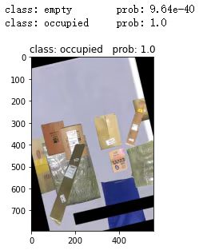
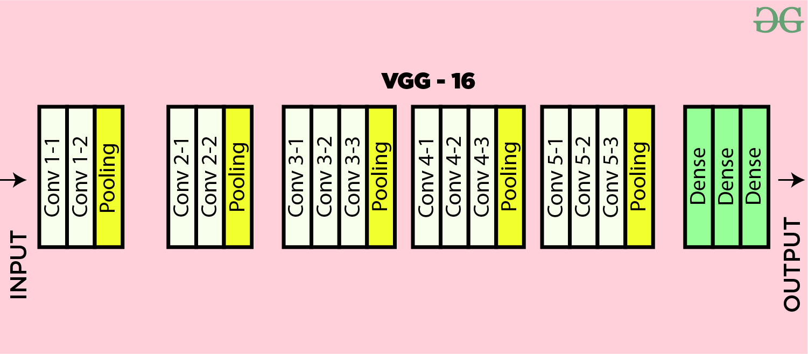

# Midterm Project

**ID: 12232418		Name: Jiang Yuchen**

## Preview

In this project, we are asked to finish the image classification task with two methods. Also, different hyper-parameters are compared during training. The given dataset consists of 2000 occupied images and 460 empty images for two-category classification.

Since the task is involved with images, one of our methods is based on Convolutional Neural Network(CNN), which is VGG16 described below. Another method is based on traditional machine learning, which is SVM that is usually used for two-category classification tasks.

Our report will show the classification task in these parts: Data preprocess, Model Selection, Experiment Analysis and Conclusion.

Our experiment environment refers to `mlai.yaml`.

## Data Preprocess

The main tasks for data preprocessing are: delete the fourth channel, split into train, validation and test sets and images transformation. 

#### Delete the fourth channel

There exists some images in empty category which have one more channel with all 255. All we should do is to delete the channel. Refer to `preprocess.py` , we examine all images and read them into array to test whether their shapes are correct or not. If not, we will only take the first three channels for subsequent experiments. It is noticed that we save the processed image in `.png` style for convenience.

#### Split sets

According to `split.py` in data folder, we split the processed images into train, validation and test sets with split rate of 8:1:1. It will be useful for deep learning method. The folders `train`, `val` and `test` in `data` folder represent the sets.

#### Images transformation

Here we transform the images with the same process "Resize" and "Normalize" for deep learning methods. Resize operation guarantee that the images for deep learning are in the same size. Normalize operation guarantee quick fitting.

## Model Selection

For deep learning method, we choose **VGG16** network as our model. It is one of the successful models for image classification. Also, the performance of VGG16 is good enough so that we just take it as deep learning model instead of adding other CNN based model.

For machine learning method, we choose **SVM**(Support Vector Machine) as our model. SVM is a classical model for two-category classification. Besides, hyper parameters of SVM are clear for us. Therefore, SVM is chosen as machine learning model.

## Experiment Analysis

In this part we will analyze different model by analyzing hyper parameters and comparing the evaluation metrics, like recall, precision and f1 score.

​															Figure 1 Test example

### VGG16

First, we build the network and try to set different hyper parameters for it. We keep the original network and choose **learning rate** and **dropout probability** as hyper parameters to analyze. Our batch size is 32 and epoch is 30. Details show in `Classification_VGG16.ipynb` and `Prediction_VGG16.ipynb` . We resize the images into the size of 224x224x3. 

​															Figure 2 VGG16 model

We set different **learning rate**: 0.01, 0.001 and 0.0001. Different **dropout rate**: 0, 0.1 and 0.5.

The results show that dropout doesn't affect the performance. However, learning rate determine the performance. When we use 0.01 and 0.001 as learning rate, we can't reach the global minimum loss and the best accuracy is 0.8156. As we set 0.0001 as learning rate, the best accuracy can reach 0.9918, which is an efficient improvement.

For testing, we select the best model whose learning rate is 0.0001 to see the **accuracy, recall, precision and f1 score**. They are **0.9756, 0.995, 0.9755 and 0.9851** respectively.

### SVM

SVM is support vector machine. Common hyper parameters are 'C', 'gamma' and 'kernel' to decide the best performance. We also set different hyper parameter sets for model training. Refer to `ML.ipynb`, we set C as [0,1, 1, 10, 100], gamma as [0.0001, 0.001, 0.1, 1] and kernel as 'rbf'. Parameter 'C' controls the penalty, which means that higher 'C' leads to more strict classification. Parameter 'gamma' means the coefficient of kernel function, which implicitly determine the data distribution in mapped space. 

Since we can't directly use images array for model training, we need to flatten the images array. Besides, resize operation is needed to reduce the complexity of training (it really takes time!). We resize each image into the size of 80x80x3 and flatten it.

The results show that the pair `{C: 10, gamma:0.001}` gets the best performance. Thus, we will use it for testing. The performance metrics shows below.

**Accuracy: 0.9533		Recall: 0.9775		Precision: 0.9654		F1 Score: 0.9714**

### Analysis

| Model\Performance | Accuracy   | Recall     | Precision  | F1 Score   |
| ----------------- | ---------- | ---------- | ---------- | ---------- |
| **SVM**           | **0.9533** | **0.9755** | **0.9654** | **0.9714** |
| **VGG16**         | **0.9756** | **0.995**  | **0.9755** | **0.9851** |

First, it's obvious that CNN based model performs better than traditional machine learning method since CNN layers take full use of the features in images, which means that CNN based model is more suitable for image classification task.

Besides, SVM also achieve a not bad performance. We guess that our dataset and the task is too simple so even SVM also performs well in the task. If we change the two-category classification task into object detection and classification task, SVM may fail.

What's more, our metrics are defined for real life application. For example, if we focus on examining occupied situation, then precision and recall are important since we should capture as many occupied ones as we can. Precision measures how many of the positive predictions made are correct and recall measures how many of the positive cases the classifier correctly predicted, over all the positive cases in the data. F1-Score is a measure combining both precision and recall. It is generally described as the harmonic mean of the two. Harmonic mean is just another way to calculate an “average” of values, generally described as more suitable for ratios (such as precision and recall) than the traditional arithmetic mean.

All in all, two methods performs well in this task.

## Conclusion

In this project, we set up two methods for image classification and get their performance. We also set different hyper parameters to see whether they make difference to the results. Both machine learning method and neural network method are used to solve the problem, which also helps me review the knowledge learning during the half term.

